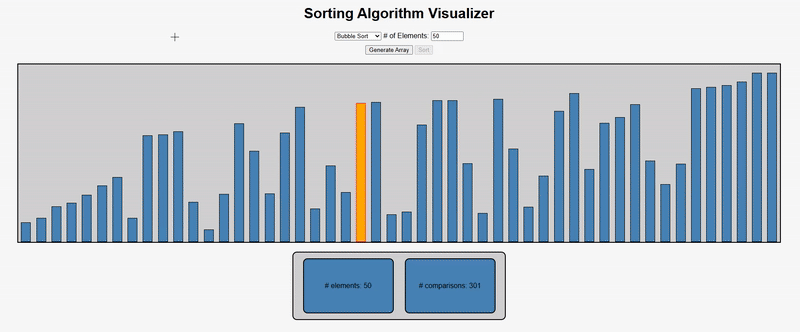

# SortingAlgorithmVisualizer
A sorting algorithm visualizer made using HTML, CSS, and JavaScript.

# How to Use
Download the zip file or clone the GitHub repo. Afterwards, open index.html in your browser of choice.  
```
git clone https://github.com/EthenStiles/SortingAlgorithmVisualizer
```

# Example


# Features
- Sorting Algorithms
  - Bubble Sort
  - Insertion Sort
  - Selection Sort
  - Quick Sort
  - Bogo Sort
- User defined number of elements
- User defined animation speed

# TODO
Add sound  
Better CSS
